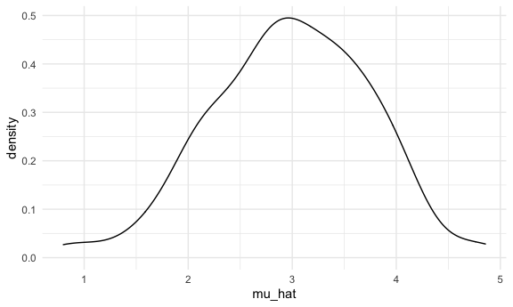
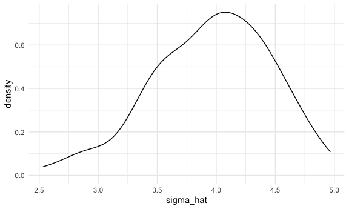
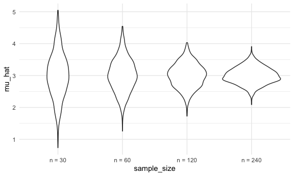

Simulation
================

## Let’s simulate something

I have a function

``` r
sim_mean_sd = function(samp_size, mu = 3, sigma = 4) {
  
  sim_data = tibble(
    x = rnorm(n = samp_size, mean = mu, sd = sigma),
  )
  
  sim_data %>% 
    summarize(
      mu_hat = mean(x),
      sigma_hat = sd(x)
    )
}
```

I can `simulate` by running this line

``` r
sim_mean_sd(30)
```

    ## # A tibble: 1 x 2
    ##   mu_hat sigma_hat
    ##    <dbl>     <dbl>
    ## 1   3.33      3.70

## Let’s simulate a lot

Let’s start with a for loop

``` r
output = vector("list", 100)

for (i in 1:100) {
  output[[i]] = sim_mean_sd(samp_size = 30)
}

sim_results = bind_rows(output)  # 不想要output是一个list，看起来不直观，用`bind_rows`变成data set
```

Let’s use a loop function

``` r
sim_results = 
  rerun(100, sim_mean_sd(samp_size = 30)) %>% 
  bind_rows()
```

Let’s look at results

``` r
sim_results %>% 
  ggplot(aes(x = mu_hat)) +
  geom_density()
```



``` r
sim_results %>% 
  ggplot(aes(x = sigma_hat)) +
  geom_density()
```



``` r
sim_results %>% 
  summarize(
    avg_samp_mean = mean(mu_hat),
    sd_samp_mean = sd(mu_hat)
  )
```

    ## # A tibble: 1 x 2
    ##   avg_samp_mean sd_samp_mean
    ##           <dbl>        <dbl>
    ## 1          2.98        0.756

``` r
4/sqrt(30) # close to above result
```

    ## [1] 0.7302967

## Let’s try other sample sizes

``` r
n_list = 
  list(
    "n = 30" = 30,
    "n = 60" = 60,
    "n = 120" = 120,
    "n = 240" = 240
  )

output = vector("list", length = 4)

output[[1]] = rerun(100, sim_mean_sd(samp_size = n_list[[1]])) %>% bind_rows()
output[[2]] = rerun(100, sim_mean_sd(samp_size = n_list[[2]])) %>% bind_rows()

for(i in 1:4) {
  output[[i]] = 
    rerun(100, sim_mean_sd(samp_size = n_list[[i]])) %>% 
    bind_rows()
}
```

``` r
#`cache =`  means we don't want this result run again and again during knit, we want save this result in the corner and keep using them. 但是如果改了代码，这个chuck很容易break

tibble(
  sample_size = c(30, 60, 120, 240)) %>% 
  mutate(
    output_lists = map(.x = sample_size, ~rerun(10,sim_mean_sd(.x)))
  ) %>% pull(output_lists)
```

    ## [[1]]
    ## [[1]][[1]]
    ## # A tibble: 1 x 2
    ##   mu_hat sigma_hat
    ##    <dbl>     <dbl>
    ## 1   3.25      3.66
    ## 
    ## [[1]][[2]]
    ## # A tibble: 1 x 2
    ##   mu_hat sigma_hat
    ##    <dbl>     <dbl>
    ## 1   3.37      3.90
    ## 
    ## [[1]][[3]]
    ## # A tibble: 1 x 2
    ##   mu_hat sigma_hat
    ##    <dbl>     <dbl>
    ## 1   2.21      3.70
    ## 
    ## [[1]][[4]]
    ## # A tibble: 1 x 2
    ##   mu_hat sigma_hat
    ##    <dbl>     <dbl>
    ## 1   3.51      3.66
    ## 
    ## [[1]][[5]]
    ## # A tibble: 1 x 2
    ##   mu_hat sigma_hat
    ##    <dbl>     <dbl>
    ## 1   3.17      5.27
    ## 
    ## [[1]][[6]]
    ## # A tibble: 1 x 2
    ##   mu_hat sigma_hat
    ##    <dbl>     <dbl>
    ## 1   4.29      3.58
    ## 
    ## [[1]][[7]]
    ## # A tibble: 1 x 2
    ##   mu_hat sigma_hat
    ##    <dbl>     <dbl>
    ## 1   2.58      4.61
    ## 
    ## [[1]][[8]]
    ## # A tibble: 1 x 2
    ##   mu_hat sigma_hat
    ##    <dbl>     <dbl>
    ## 1   2.67      4.40
    ## 
    ## [[1]][[9]]
    ## # A tibble: 1 x 2
    ##   mu_hat sigma_hat
    ##    <dbl>     <dbl>
    ## 1   2.87      4.57
    ## 
    ## [[1]][[10]]
    ## # A tibble: 1 x 2
    ##   mu_hat sigma_hat
    ##    <dbl>     <dbl>
    ## 1   3.86      4.16
    ## 
    ## 
    ## [[2]]
    ## [[2]][[1]]
    ## # A tibble: 1 x 2
    ##   mu_hat sigma_hat
    ##    <dbl>     <dbl>
    ## 1   2.51      3.99
    ## 
    ## [[2]][[2]]
    ## # A tibble: 1 x 2
    ##   mu_hat sigma_hat
    ##    <dbl>     <dbl>
    ## 1   3.54      3.94
    ## 
    ## [[2]][[3]]
    ## # A tibble: 1 x 2
    ##   mu_hat sigma_hat
    ##    <dbl>     <dbl>
    ## 1   2.54      4.05
    ## 
    ## [[2]][[4]]
    ## # A tibble: 1 x 2
    ##   mu_hat sigma_hat
    ##    <dbl>     <dbl>
    ## 1   3.59      4.19
    ## 
    ## [[2]][[5]]
    ## # A tibble: 1 x 2
    ##   mu_hat sigma_hat
    ##    <dbl>     <dbl>
    ## 1   3.01      3.97
    ## 
    ## [[2]][[6]]
    ## # A tibble: 1 x 2
    ##   mu_hat sigma_hat
    ##    <dbl>     <dbl>
    ## 1   2.63      4.02
    ## 
    ## [[2]][[7]]
    ## # A tibble: 1 x 2
    ##   mu_hat sigma_hat
    ##    <dbl>     <dbl>
    ## 1   3.63      4.05
    ## 
    ## [[2]][[8]]
    ## # A tibble: 1 x 2
    ##   mu_hat sigma_hat
    ##    <dbl>     <dbl>
    ## 1   3.54      3.51
    ## 
    ## [[2]][[9]]
    ## # A tibble: 1 x 2
    ##   mu_hat sigma_hat
    ##    <dbl>     <dbl>
    ## 1   1.58      3.98
    ## 
    ## [[2]][[10]]
    ## # A tibble: 1 x 2
    ##   mu_hat sigma_hat
    ##    <dbl>     <dbl>
    ## 1   2.73      3.80
    ## 
    ## 
    ## [[3]]
    ## [[3]][[1]]
    ## # A tibble: 1 x 2
    ##   mu_hat sigma_hat
    ##    <dbl>     <dbl>
    ## 1   2.71      4.18
    ## 
    ## [[3]][[2]]
    ## # A tibble: 1 x 2
    ##   mu_hat sigma_hat
    ##    <dbl>     <dbl>
    ## 1   3.53      4.39
    ## 
    ## [[3]][[3]]
    ## # A tibble: 1 x 2
    ##   mu_hat sigma_hat
    ##    <dbl>     <dbl>
    ## 1   3.19      4.06
    ## 
    ## [[3]][[4]]
    ## # A tibble: 1 x 2
    ##   mu_hat sigma_hat
    ##    <dbl>     <dbl>
    ## 1   2.46      3.90
    ## 
    ## [[3]][[5]]
    ## # A tibble: 1 x 2
    ##   mu_hat sigma_hat
    ##    <dbl>     <dbl>
    ## 1   3.30      3.55
    ## 
    ## [[3]][[6]]
    ## # A tibble: 1 x 2
    ##   mu_hat sigma_hat
    ##    <dbl>     <dbl>
    ## 1   2.62      3.96
    ## 
    ## [[3]][[7]]
    ## # A tibble: 1 x 2
    ##   mu_hat sigma_hat
    ##    <dbl>     <dbl>
    ## 1   3.36      3.93
    ## 
    ## [[3]][[8]]
    ## # A tibble: 1 x 2
    ##   mu_hat sigma_hat
    ##    <dbl>     <dbl>
    ## 1   3.30      4.27
    ## 
    ## [[3]][[9]]
    ## # A tibble: 1 x 2
    ##   mu_hat sigma_hat
    ##    <dbl>     <dbl>
    ## 1   3.48      3.83
    ## 
    ## [[3]][[10]]
    ## # A tibble: 1 x 2
    ##   mu_hat sigma_hat
    ##    <dbl>     <dbl>
    ## 1   2.89      4.26
    ## 
    ## 
    ## [[4]]
    ## [[4]][[1]]
    ## # A tibble: 1 x 2
    ##   mu_hat sigma_hat
    ##    <dbl>     <dbl>
    ## 1   3.18      4.17
    ## 
    ## [[4]][[2]]
    ## # A tibble: 1 x 2
    ##   mu_hat sigma_hat
    ##    <dbl>     <dbl>
    ## 1   2.99      3.83
    ## 
    ## [[4]][[3]]
    ## # A tibble: 1 x 2
    ##   mu_hat sigma_hat
    ##    <dbl>     <dbl>
    ## 1   2.80      3.72
    ## 
    ## [[4]][[4]]
    ## # A tibble: 1 x 2
    ##   mu_hat sigma_hat
    ##    <dbl>     <dbl>
    ## 1   2.71      4.21
    ## 
    ## [[4]][[5]]
    ## # A tibble: 1 x 2
    ##   mu_hat sigma_hat
    ##    <dbl>     <dbl>
    ## 1   3.17      4.01
    ## 
    ## [[4]][[6]]
    ## # A tibble: 1 x 2
    ##   mu_hat sigma_hat
    ##    <dbl>     <dbl>
    ## 1   3.31      3.96
    ## 
    ## [[4]][[7]]
    ## # A tibble: 1 x 2
    ##   mu_hat sigma_hat
    ##    <dbl>     <dbl>
    ## 1   2.90      3.79
    ## 
    ## [[4]][[8]]
    ## # A tibble: 1 x 2
    ##   mu_hat sigma_hat
    ##    <dbl>     <dbl>
    ## 1   3.22      3.98
    ## 
    ## [[4]][[9]]
    ## # A tibble: 1 x 2
    ##   mu_hat sigma_hat
    ##    <dbl>     <dbl>
    ## 1   2.74      4.34
    ## 
    ## [[4]][[10]]
    ## # A tibble: 1 x 2
    ##   mu_hat sigma_hat
    ##    <dbl>     <dbl>
    ## 1   2.91      3.98

``` r
tibble(
  sample_size = c(30, 60, 120, 240)) %>% 
  mutate(
    output_lists = map(.x = sample_size, ~rerun(10,sim_mean_sd(.x))),
    estimate_df = map(output_lists, bind_rows)
  ) %>% pull(estimate_df)
```

    ## [[1]]
    ## # A tibble: 10 x 2
    ##    mu_hat sigma_hat
    ##     <dbl>     <dbl>
    ##  1   3.59      3.04
    ##  2   3.05      4.14
    ##  3   2.95      3.37
    ##  4   3.01      3.56
    ##  5   3.29      4.33
    ##  6   3.94      4.31
    ##  7   1.39      3.82
    ##  8   2.96      4.55
    ##  9   3.35      5.25
    ## 10   3.11      3.83
    ## 
    ## [[2]]
    ## # A tibble: 10 x 2
    ##    mu_hat sigma_hat
    ##     <dbl>     <dbl>
    ##  1   2.64      4.25
    ##  2   1.61      3.96
    ##  3   2.97      3.84
    ##  4   3.10      3.95
    ##  5   2.76      4.09
    ##  6   3.12      3.54
    ##  7   2.35      3.36
    ##  8   2.81      3.65
    ##  9   3.29      4.28
    ## 10   2.58      4.28
    ## 
    ## [[3]]
    ## # A tibble: 10 x 2
    ##    mu_hat sigma_hat
    ##     <dbl>     <dbl>
    ##  1   2.47      3.78
    ##  2   2.97      4.33
    ##  3   2.92      4.06
    ##  4   2.76      3.85
    ##  5   2.87      4.14
    ##  6   3.12      4.11
    ##  7   3.58      3.72
    ##  8   2.34      3.96
    ##  9   3.03      4.04
    ## 10   3.06      3.64
    ## 
    ## [[4]]
    ## # A tibble: 10 x 2
    ##    mu_hat sigma_hat
    ##     <dbl>     <dbl>
    ##  1   3.11      3.79
    ##  2   3.14      3.86
    ##  3   2.59      3.90
    ##  4   2.90      3.62
    ##  5   3.11      3.67
    ##  6   3.32      4.00
    ##  7   2.69      4.09
    ##  8   2.60      3.56
    ##  9   2.66      4.00
    ## 10   2.96      4.04

``` r
sim_result = 
  tibble(
    sample_size = c(30, 60, 120, 240)) %>% 
  mutate(
    output_lists = map(.x = sample_size, ~rerun(1000,sim_mean_sd(.x))),
    estimate_df = map(output_lists, bind_rows)
  ) %>% 
  select(-output_lists) %>% 
  unnest(estimate_df)
```

do some data frame things

``` r
sim_result %>% 
  mutate(
    sample_size = str_c("n = ", sample_size),
    sample_size = fct_inorder(sample_size)
  ) %>% 
  ggplot(aes(x = sample_size, y = mu_hat)) +
  geom_violin()
```



``` r
sim_result %>%
  group_by(sample_size) %>% 
  summarize(
    avg_samp_mean = mean(mu_hat),
    sd_samp_mean = sd(mu_hat) 
  )
```

    ## `summarise()` ungrouping output (override with `.groups` argument)

    ## # A tibble: 4 x 3
    ##   sample_size avg_samp_mean sd_samp_mean
    ##         <dbl>         <dbl>        <dbl>
    ## 1          30          3.02        0.709
    ## 2          60          3.01        0.521
    ## 3         120          3.00        0.377
    ## 4         240          3.00        0.261
